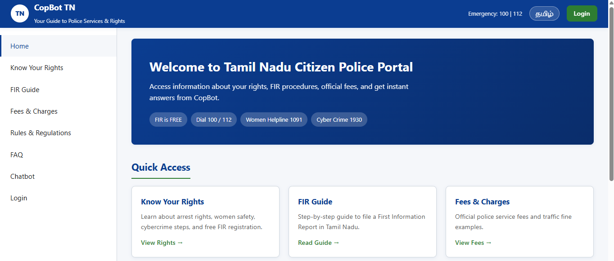
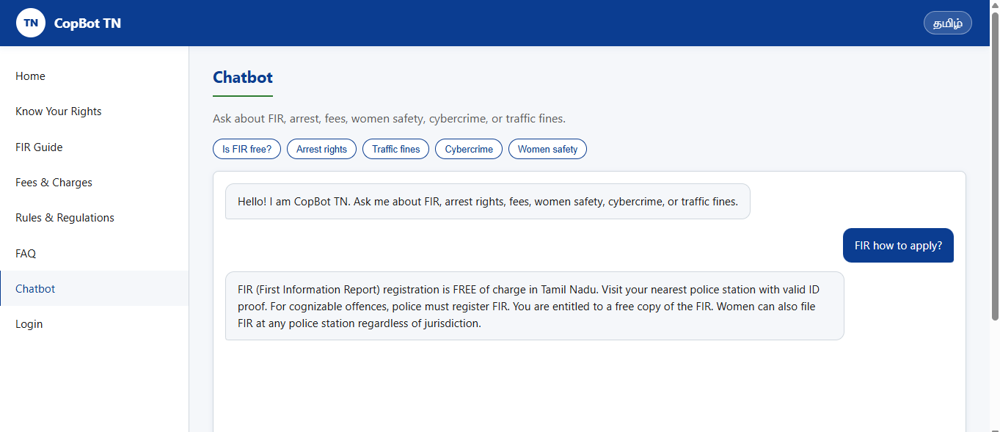
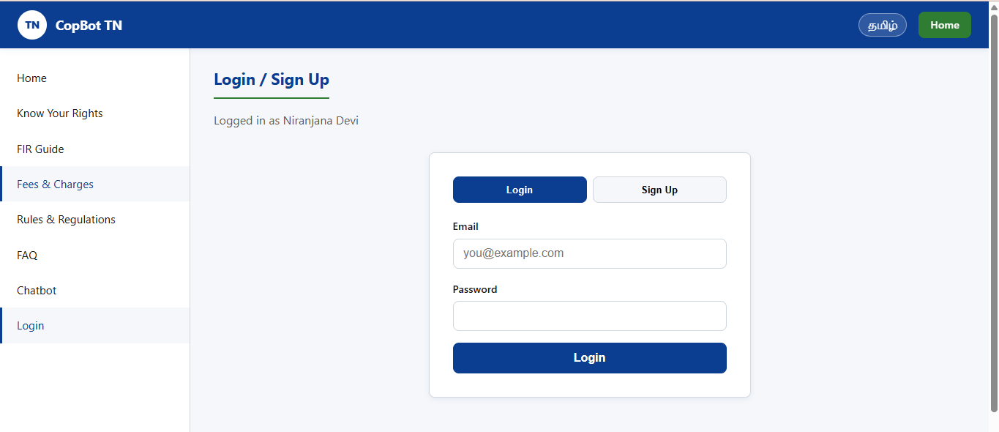
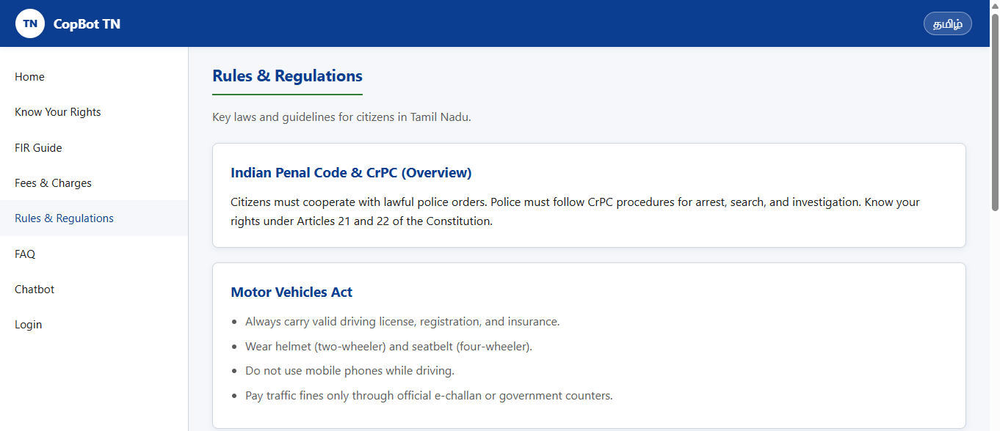

# CopBot TN – Your Guide to Police Services & Rights

A professional government-style citizen help portal for Tamil Nadu. Provides information on citizen rights, FIR procedures, official fees, FAQs, and an AI-style keyword chatbot.

## Tech Stack

| Layer    | Technology              |
|----------|-------------------------|
| Frontend | HTML, CSS, JavaScript   |
| Backend  | Java Spring Boot 3.2    |
| Database | MySQL                   |

## Project Structure

```
copbot-tn/
├── frontend/          # Static web pages
├── backend/           # Spring Boot REST API
└── README.md
```

## Prerequisites

- **Java 17+**
- **Maven 3.8+**
- **MySQL 8+**
- A browser and optionally [Live Server](https://marketplace.visualstudio.com/items?itemName=ritwickdey.LiveServer) for frontend

## Database Setup

1. Start MySQL.
2. Create database (optional — auto-created if configured):

```sql
CREATE DATABASE IF NOT EXISTS copbot_tn;
```

3. Update credentials in `backend/src/main/resources/application.properties`:

```properties
spring.datasource.username=root
spring.datasource.password=YOUR_PASSWORD
```

## Run Backend (Port 8080)

```bash
cd backend
mvn spring-boot:run
```

On first run, tables are created and sample data is loaded from `data.sql`.

### REST APIs

| Method | Endpoint              | Description        |
|--------|-----------------------|--------------------|
| POST   | `/api/auth/signup`    | Register user      |
| POST   | `/api/auth/login`     | Login user         |
| GET    | `/api/rights`         | List citizen rights|
| GET    | `/api/fees`           | List fees/charges  |
| GET    | `/api/faqs`           | List FAQs          |
| POST   | `/api/chatbot/ask`    | Ask chatbot        |

**Example – Chatbot:**

```json
POST /api/chatbot/ask
{ "question": "Is FIR free?" }
```

## Run Frontend

1. Ensure backend is running on `http://localhost:8080`.
2. Open `frontend/index.html` in a browser, or use Live Server from the `frontend` folder.

> **Note:** If opening HTML as `file://`, some browsers may block API calls. Use Live Server or any local static server for best results.

## Features

- Government-style responsive UI (dark blue / green theme)
- Tamil / English label toggle (UI only)
- BCrypt password hashing
- Keyword-based chatbot (FIR, arrest, fees, women safety, cybercrime, traffic)
- Preloaded sample content in MySQL

## Emergency Numbers

- Police: **100**
- All-in-one: **112**
- Women Helpline: **1091**
- Cyber Financial Fraud: **1930**

---
## 📸 Screenshots

### 🏠 Homepage


### 🤖 Chatbot


### 🔐 Login


## 📸 Screenshots

### 🏠 Homepage


### 🤖 Chatbot


### 🔐 Login


### 🔐 Rules



*This portal is for informational purposes only. For emergencies, dial 100 or 112.*
